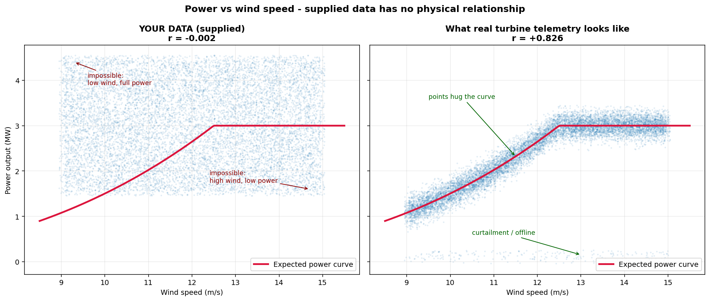
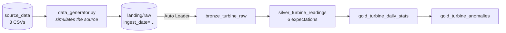
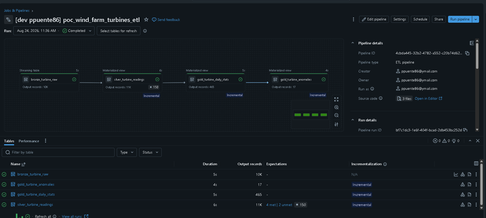

# Wind Farm Data Pipeline

A Databricks pipeline that ingests readings, cleans them, calculates
daily statistics per turbine, flags turbines deviating from the fleet, and stores the
results as Delta tables in Unity Catalog.

Lakeflow Spark Declarative Pipelines, deployed with a Databricks Asset Bundle.

---
## The problem

15 turbines send hourly readings — wind speed, wind direction, power output in MW —
as three CSV files, one per group of five turbines, appended daily. The system
sometimes misses entries because of sensor malfunctions.

The pipeline cleans the data, calculates min/max/average power per turbine over 24
hours, flags turbines more than 2 standard deviations from the mean, and stores it all
for analysis.

## What I found before building

I profiled the input first, and it changed the design.

Power output has **no relationship with wind speed** (correlation -0.0025). Every wind
band from 9 to 15 m/s contains the full power range of 1.5 to 4.5 MW. The turbines do
not share weather either — the variance explained by the timestamp is 0%, and randomly
shuffled timestamps score the same.



That matters because a uniform distribution spans only 1.73 standard deviations end to
end, so **no individual reading can ever be 2 standard deviations from the mean**. On
daily averages the rule does fire - but only on sampling noise, never on a real fault,
because there are no real faults in this data to find.

So I wrote a source simulator that replays the month one day at a time and injects
faults, recording every one in a manifest. That is what lets me verify detection
rather than assert it.

Analysis in [`tools/nb_data_analysis.ipynb`](tools/nb_data_analysis.ipynb).

## Architecture



| Layer | Does |
|---|---|
| **Bronze** | Captures what landed, unchanged. Every column a string, so a bad value can't fail the load |
| **Silver** | Casts, validates against 6 expectations, deduplicates on `(turbine_id, event_ts)` |
| **Gold** | Daily statistics per turbine, then anomalies scored on those statistics |

The generator is not part of the pipeline — it stands in for the SCADA system, and is
neither deployed nor scheduled.

## Running it

```sql
-- 1. tools/00_setup.sql — creates catalog, schema, volume
```
Upload the CSVs from [`data/`](data) to `/Volumes/turbine_poc/wind_farm/landing/source_data`.

```python
# 2. Generate data — tools/nb_data_generator_run.ipynb
import data_generator as gen

gen.land_next(noise=True)          # one day - run the pipeline, repeat

while gen.land_next(noise=True):   # or the whole month in one go
    pass
gen.summarise()
```

A day at a time is how the source actually behaves, and running the pipeline between
each one shows the incremental load working. The loop lands all 31 days at once, which
is what reproduces the numbers in [Results](#results).

```bash
# 3. Deploy and run in Databricks
databricks bundle validate -t dev --profile dell-workspace
databricks bundle deploy -t dev --profile dell-workspace
databricks bundle run turbine_etl -t dev --profile dell-workspace

# 4. Run the unit tests locally
.\.venv\Scripts\python.exe -m pytest -q
```

The local tests run the DataFrame transformations with PySpark and do not require a
Databricks workspace. On a new checkout, install the test dependencies first:

```powershell
python -m venv .venv
.\.venv\Scripts\python.exe -m pip install pytest pyspark
.\.venv\Scripts\python.exe -m pytest -q
```

The Databricks bundle run is the integration check: it executes the Bronze, Silver and
Gold pipeline in the configured workspace. Review the pipeline expectations and output
tables there after the run. Replace `dell-workspace` with the name of your Databricks
CLI profile if you use a different workspace.

Then [`tools/99_verify.sql`](tools/99_verify.sql) for row counts, the injected faults,
and per-rule pass/fail counts from the event log.

> Regenerating a day that already landed reuses the same file paths, and Auto Loader
> tracks by path — so use **Full refresh all** after regenerating. A new day only needs
> a normal start.

## Results

| | |
|---|---|
| `bronze_turbine_raw` | 11,112 |
| `silver_turbine_readings` | 10,962 |
| **Rejected by expectations** | **150** |
| `gold_turbine_daily_stats` | 465 *(15 turbines × 31 days)* |
| `gold_turbine_anomalies` | 17 |



The 150 is exact — the simulator injected 57 nulls and 93 out-of-range values, and the
pipeline rejected exactly those. Nothing missed, nothing good discarded.

17 of 465 turbine-days is 3.7% - the false-positive rate a 2σ threshold produces on any
well-behaved population. Those are not 17 real faults, and they are not artefacts of my
simulator either. Running the same rule over the untouched source CSVs, with nothing
injected, flags 17 turbine-days as well, spread across 17 different days. The threshold
is doing what a threshold does.

What separates the real fault from that background is magnitude. The worst flag in the
clean data reaches z = -2.63; turbine 7 reaches -3.035, with roughly double the
deviation in MW. So the output is worth ranking by |z| rather than treating every flag
as an alert - which is also why the anomaly table carries `z_score` and `deviation_mw`
rather than a boolean.

**The two deliberate faults**, both on 2 March, show up in different places:

| | Fault | Completeness | Anomaly |
|---|---|---|---|
| Turbine 3 | Sensor offline 6h | **75%** | not flagged |
| Turbine 7 | 12h at 35% output | 95.8% | **z = −3.035** |

Turbine 3 lost data but its average is normal. Turbine 7 has nearly complete data but a
daily average of 2.06 against a fleet mean of 2.92. Missing data and abnormal data are
different problems, reported separately.

## Design decisions

Full set in [docs/DECISIONS.md](docs/DECISIONS.md), with what I'd do differently in
production. The four that matter most:

**Anomalies are scored on the daily average, not individual readings.** A single
reading has a spread of ~0.87 MW; a daily average has ~0.18. I tested it with an
injected fault — per-reading scoring missed it at z = −1.87, daily scoring caught it at
−3.035. The brief asks for turbines that deviated over a period, and the grain decides
whether it works at all.

**Missing power is removed, not imputed.** It's the measured business figure — imputing
it invents generation that never happened. I publish `completeness_pct` beside every
statistic instead, so an average over 18 readings isn't mistaken for one over 24.

**Validation is declarative, computation is code.** Cleaning rules are SQL
expectations — I don't need to test that `BETWEEN` works, and the pipeline gives me
per-rule counts for free. The aggregation and anomaly logic is Python, because that's
my own reasoning and it has tests.

**The fleet comparison is a distributional test, not a physical one.** Comparing
turbines usually rests on them sharing weather. I measured it; they don't. All 15 draw
from the same distribution so the comparison holds — but I'd rather say what it is.

## Assumptions

- Readings are hourly — 24 per turbine per day
- Turbine IDs are 1–15 and stable
- Timestamps are naive/UTC. The month has exactly 744 hourly timestamps, so it ignores
  the UK clock change on 27 March
- Power above 5 MW is a sensor error (data tops out at 4.5, so ~4.5 MW nameplate plus
  headroom). The lower bound stays at 0 — a turbine legitimately produces zero when
  calm, curtailed or in maintenance
- Wind above 40 m/s is a sensor error; turbines shut down around 25 but anemometers
  keep reading
- A later `ingest_ts` for the same turbine and timestamp is a correction and wins
- The landing zone holds immutable files — a correction arrives as a new file

## Scale

At 15 turbines and 360 rows a day this is trivial. The first limits I'd hit: directory
listing slows with many files (switch Auto Loader to file notification mode), and the
fleet comparison shuffles all turbines per day (fine at 15, pre-aggregate at thousands).
I clustered rather than partitioned by date — at this volume partitioning would create
tiny files and make things worse.

Free Edition allows one active pipeline per type, so all three layers sit in one
pipeline. In production I'd split ingestion from transformation so they can be scheduled
and scaled independently.

## With more time

- Replace the 2σ rule with something robust (MAD or IQR) — with 24 readings one extreme
  value inflates the standard deviation enough to partly hide itself
- Quarantine rejected rows instead of dropping them, so they can be replayed after an
  upstream fix
- A turbine dimension with point-in-time status, so a turbine in maintenance is excluded
  from the baseline rather than flagged
- Publish availability separately from completeness — different problems, different teams

