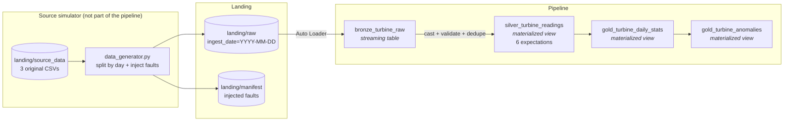

# Wind Turbine Data Pipeline

A Databricks pipeline for a wind farm of 15 turbines. It ingests daily CSV files, cleans
them, calculates daily statistics per turbine, flags turbines that deviate from the fleet,
and stores everything as Delta tables in Unity Catalog.

Built with Lakeflow Spark Declarative Pipelines on Databricks Free Edition.

---

## 1. The problem

Turbines send hourly readings: wind speed, wind direction, power output in MW.

Data arrives as 3 CSV files, one per group of 5 turbines. A turbine always appears in the
same file. Each day the file is updated with the last 24 hours, and the system sometimes
misses entries because of sensor malfunctions.

The pipeline has to clean the data, calculate min/max/average power per turbine over 24
hours, identify turbines more than 2 standard deviations from the mean, and store the
results for analysis.

---

## 2. What I found in the data before building anything

I profiled the input first, in `tools/nb_data_analysis.ipynb`. What I found changed how I
built the rest, so it goes before the architecture.

**The supplied data is completely clean.** 11,160 rows, 15 turbines, 744 hourly timestamps
each, March 2022. No duplicates, no nulls, no missing hours, no out-of-range values.

**Power output has no relationship with wind speed.** I expected a power curve. What I got
was a correlation of **-0.0025**. I checked it per turbine as well and every one of them
sits at zero, within sampling noise.

Every wind speed band from 9 to 15 m/s contains the full power range of 1.5 to 4.5 MW, with
a standard deviation between 0.85 and 0.91 and a mean flat at 3.0 in all of them. On a
scatter plot the points fill the entire rectangle, including combinations that are
physically impossible: full rated output at 9 m/s, minimum output at 15 m/s.

It looks like synthetic data generated with something like `uniform(1.5, 4.5)`.


**The turbines do not share weather either.** I split the variance of wind speed into the
part explained by the timestamp and the part within a timestamp. If all 15 turbines were on
one site they would see similar wind at the same hour, and most of the variance would sit
between hours. It came out at **0%**. I re-ran the same test with randomly shuffled
timestamps and got the same answer, which confirms the real timestamps carry no information.

**Why this matters for requirement 3.** A uniform distribution spans only 1.73 standard
deviations from end to end, so no reading can ever be 2 standard deviations from the mean.
The rule the brief asks for cannot fire on the data as supplied.

### What I did about it

I built a source simulator (`tools/data_generator.py`) that replays the supplied month one
day at a time and injects faults on the way. It writes a manifest of everything it breaks,
so every claim about detection can be checked against a known injected fault rather than
taken on trust.

I kept the original files as the clean baseline instead of replacing them with a different
dataset. The brief supplies this data and explicitly allows adding and removing rows to
test the requirements.

I considered augmenting with real reanalysis wind data to give the set some physical
structure. I decided against it: the 2 standard deviation rule is univariate — it only ever
looks at power output — so the pipeline behaves identically either way, and injected faults
give me deterministic ground truth that real weather cannot.

---

## 3. Architecture



Standard medallion. Bronze captures, silver conforms and validates, gold aggregates.

**The source simulator is not part of the pipeline.** It stands in for the SCADA system I
don't have. It is not deployed and not scheduled — in production the source system writes
those files itself. The pipeline starts at `landing/raw`.

**Bronze** reads new files with Auto Loader and stores them exactly as they arrived. Every
column is a string on purpose: a value like `"N/A"` in a numeric column has to reach the
table rather than kill the load. Capture is bronze's job, conforming is silver's.

**Silver** is SQL. It casts the columns, applies six expectations, and deduplicates on
`(turbine_id, event_ts)` keeping the latest ingest. Failing rows are dropped and counted in
the pipeline event log.

**Gold** has two tables: daily statistics per turbine with a completeness measure, and
turbine-days that deviate more than 2 standard deviations from the fleet.

### Why Auto Loader

Auto Loader keeps a checkpoint of the files it has already read, so re-running the pipeline
processes nothing new. I did not have to write that bookkeeping, and there is no watermark
table to keep in step.

That gives file-level idempotency. The dedupe in silver gives record-level idempotency: the
same `(turbine_id, event_ts)` resolves to one row however many times it arrives. Both
matter — the first avoids re-reading files, the second guarantees correctness if a file is
re-delivered or corrected.

---

## 4. Cleaning — requirement 1

Validation lives in `pipeline/02_silver.sql` as declarative expectations. Databricks
evaluates each rule and records pass/fail counts per rule per run in the event log, so
"what did my cleaning actually do last night" is a query rather than something I had to
build.

| Rule | Check |
|---|---|
| `valid_turbine_id` | Present and between 1 and 15 |
| `valid_timestamp` | Parses |
| `power_present` | Not null |
| `power_in_range` | Between 0 and 5 MW |
| `wind_speed_in_range` | Null, or 0 to 40 m/s |
| `wind_dir_in_range` | Null, or 0 to 359 |

I chose expectations over Python filters because I don't need to unit test that `BETWEEN`
works. Testing my own logic is worthwhile; testing Databricks isn't.

**The rules reject what is impossible, not what is unusual.** An unusually low reading is
valid data describing a real problem — catching that is gold's job. `power_present` is
separate from `power_in_range` on purpose: a missing reading and an implausible one are
different upstream problems and the event log counts them separately.

**The lower bound on power stays at 0, not at the observed 1.5.** Tightening a rule to the
range you happen to have observed means the first turbine that legitimately produces zero —
calm wind, curtailment, maintenance — gets thrown away. That is the reading you least want
to lose.

**Missing values are removed, not imputed.** The brief allows either. Power output is the
measured business figure, and imputing it invents generation that never happened, which
then flows into reporting. Instead I leave the gap and publish `completeness_pct` next to
every statistic so a consumer can see how much data an average is based on.

---

## 5. Summary statistics — requirement 2

`gold_turbine_daily_stats`, one row per turbine per day: min, max, average and standard
deviation of power, plus `reading_count`, `expected_count` (24) and `completeness_pct`.

Completeness is the column that separates this from a plain `groupBy().avg()`. An average
over 6 hours is not comparable to one over 24, and publishing the denominator is what lets
a consumer tell the difference.

---

## 6. Anomalies — requirement 3

`gold_turbine_anomalies`. Each turbine's **daily average** is compared against the fleet
average for the same day, and anything beyond 2 standard deviations is flagged.

**The grain is the important decision here.** The brief asks for *turbines* that deviated
over a *time period*, not individual readings, and the difference decides whether this works
at all. A single reading has a spread of about 0.87 MW; a daily average of 24 readings has
about 0.18 MW, roughly five times tighter.

I tested this with a real injected fault — a turbine at 35% output for 12 hours. Scoring
individual readings, the worst one reached only z = -1.87 and the fault went undetected.
Scoring the daily average, the same fault came out at **z = -3.04** and was caught.

Guards in `find_anomalies`:

- A standard deviation of zero returns null rather than dividing by zero
- Days with fewer than 5 turbines reporting are not scored — a fleet mean built from a
  handful of turbines is not worth comparing against

**An honest note on the method.** Comparing a turbine against the fleet normally rests on
the idea that all turbines see the same weather, so one below its peers must have a fault.
I measured that and it isn't true of this data — the turbines are statistically independent.
What survives is that all 15 draw from the same distribution, so this is a valid
*distributional* test rather than a physical one. On real telemetry the physical argument
would hold as well.

**On the rule itself.** With 24 readings, one extreme value inflates the standard deviation
enough to partly hide itself. A median-based method such as MAD would be more robust. I
implemented the rule as the brief specifies and I am noting the limitation here.

---

## 7. Storage — requirement 4

Everything is stored as Delta tables in Unity Catalog under `turbine_poc.wind_farm`:

| Table | Contents |
|---|---|
| `bronze_turbine_raw` | Raw capture, as landed |
| `silver_turbine_readings` | Cleaned readings, one per turbine per hour |
| `gold_turbine_daily_stats` | Summary statistics per turbine per day |
| `gold_turbine_anomalies` | Turbine-days beyond 2 standard deviations |

I did not add an external database. The workload is analytical rather than transactional,
and a second system would need syncing, securing and backing up for no gain. A relational
serving layer would only earn its place if a downstream application needed low-latency point
lookups, and it would be a projection of these tables rather than the system of record.

---

## 8. Results

Full month, all 31 days landed with faults injected:

| | |
|---|---|
| Rows landed in `raw` | 11,112 (48 removed by simulated sensor faults) |
| `bronze_turbine_raw` | 11,112 |
| `silver_turbine_readings` | 10,962 |
| Rejected by expectations | **150** |
| `gold_turbine_daily_stats` | 465 (15 turbines × 31 days) |
| `gold_turbine_anomalies` | 17 |

**The 150 is exact.** The simulator injected 57 nulls and 93 out-of-range values, and the
pipeline rejected exactly 150 rows — no false negatives, and no false positives across
11,112 rows.

**17 anomalies on 465 turbine-days is 3.7%**, which matches the baseline false-positive rate
I measured on the clean data during profiling. A 2 standard deviation threshold flags roughly
that share of a well-behaved population by construction, and it is worth stating rather than
presenting all 17 as real faults.

### The two deliberate faults

Both injected on 12 March, and they surface in different places, which is the point.

| | Fault | `completeness_pct` | Anomaly |
|---|---|---|---|
| Turbine 3 | Sensor offline 6 hours | **75%** (18 of 24) | not flagged |
| Turbine 7 | 12 hours at 35% output | 95.8% | **z = -3.035, BELOW** |

Turbine 3 lost a quarter of its data but its average is normal, so it correctly raises no
anomaly. Turbine 7 has nearly complete data but a daily average of 2.06 MW against a fleet
mean of 2.92, so it does. Missing data and abnormal data are different problems and the
pipeline reports them separately.

---

## 9. How to run it

**Setup** — run `tools/seed_0_foundations.sql` to create the catalog, schema and volume,
then upload the three `data_group_*.csv` files to
`/Volumes/turbine_poc/wind_farm/landing/source_data`.

**Generate data** — `tools/nb_data_generator_run.ipynb`:

```python
import data_generator as gen

gen.reset_landing()          # clear the landing zone
gen.land_next(noise=True)    # land the next day, run repeatedly
```

**Run the pipeline** — create a Lakeflow ETL pipeline with these settings:

| | |
|---|---|
| Source code | `pipeline/01_bronze`, `pipeline/02_silver.sql`, `pipeline/03_gold` |
| Catalog / schema | `turbine_poc` / `wind_farm` |
| Compute | Serverless |
| Mode | Triggered |

Start it after landing each day. Auto Loader decides *what* gets processed; the trigger
decides *when*. In production this would be a daily schedule or a file-arrival trigger.

**Note:** regenerating a day that has already landed writes to the same file paths, and
Auto Loader tracks files by path — so it will skip them. Use **Full refresh all** after
regenerating. Landing a new day only needs a normal start.

**Tests** — `pytest` from the repo root.

---

## 10. Assumptions

- Readings are hourly, so 24 per turbine per day
- Turbine IDs are 1 to 15 and stable
- Timestamps are naive or UTC. The supplied month has exactly 744 hourly timestamps, so it
  ignores the UK clock change on 27 March
- Power above 5 MW is a sensor error. The data tops out at 4.5, so nameplate is around
  4.5 MW and 5.0 leaves headroom for brief over-production
- Wind above 40 m/s is a sensor error. Turbines shut down around 25 m/s but anemometers
  keep reading
- A later `ingest_ts` for the same turbine and timestamp is a correction and wins
- The landing zone contract is immutable files. A correction arrives as a new file, not an
  overwrite

---

## 11. Scale

Current volume is small: 15 turbines, hourly, about 360 rows a day. These are the limits I
would expect to hit first.

| Limit | Response |
|---|---|
| Directory listing slows with many files | Auto Loader file notification mode |
| Small files | Liquid clustering on `turbine_id` and `event_ts`. I did not partition by date — at this volume it would create tiny files and make things worse |
| The fleet comparison shuffles all turbines per day | Fine at 15 turbines. At thousands, pre-aggregate before comparing across turbines |
| Skew | Turbine IDs are evenly distributed here. One turbine reporting far more often would skew the `groupBy` and need salting |

Free Edition allows one active pipeline per type, so all three layers sit in one pipeline.
In production I would split ingestion from transformation so they can be scheduled and
scaled independently — ingestion is small and frequent, transformation is heavier and can
lag.

---

## 12. What I would do with more time

- Replace the 2 standard deviation rule with a robust method (MAD or IQR)
- Route rejected rows to a quarantine table instead of dropping them, so they can be
  investigated and replayed after an upstream fix. Right now they are counted in the event
  log but not retained
- Add a turbine dimension with point-in-time status, so a turbine in scheduled maintenance
  is excluded from the fleet baseline and not flagged as an anomaly. I left this out
  deliberately — it is a couple of hours for something the brief does not ask for
- Publish availability separately from completeness. They are different problems for
  different teams: a turbine in maintenance has full data completeness and zero availability
- Alerting on the data quality metrics rather than only storing them
- Deploy through the asset bundle rather than the UI, so the pipeline configuration is
  versioned with the code

---

## 13. Repository

```
pipeline/
  01_bronze          Auto Loader ingest, Python
  02_silver.sql      cleaning and dedupe, SQL with expectations
  03_gold            summary statistics and anomalies, Python
turbine/
  transforms.py      all gold logic as plain DataFrame functions
tools/
  data_generator.py  source simulator
  nb_data_analysis   profiling notebook
  nb_data_generator_run
  seed_0_foundations.sql
tests/
docs/
  plan_decisions.md  build log, written as I went
databricks.yml
```

**Why the logic sits outside the pipeline files.** Declarative pipeline code only executes
inside a pipeline run, so anything written inside the decorated functions cannot be unit
tested. `turbine/transforms.py` imports nothing from the pipeline API, which means the same
functions run on Databricks and under pytest with a local Spark session. The pipeline files
are three-line wrappers.

I originally intended to do all the transformations this way. I moved the cleaning into SQL
expectations instead, on the basis that I don't need to test Databricks' own functionality —
what is worth testing is my own logic, which is the aggregation grain and the anomaly guards.

**Note on AI use.** I planned this with Claude and wrote up my reasoning as I went in
`docs/plan_decisions.md`. The design decisions, the data analysis and the implementation are
mine.