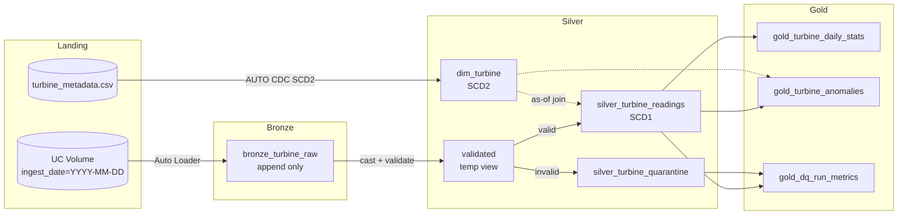

# Wind Turbine Data Pipeline

A data pipeline for a wind farm of 15 turbines. It ingests daily CSV files, cleans them,
calculates daily statistics per turbine, flags anomalies, and stores everything in Delta tables.

Built on Databricks with Lakeflow Spark Declarative Pipelines.

---

## 1. The problem

Turbines send hourly readings: wind speed, wind direction, power output.

The data arrives as 3 CSV files, one per group of 5 turbines. Each file is appended daily
with the last 24 hours. A turbine always appears in the same file.

The sensors are not reliable. Entries go missing. Values can be wrong.

The pipeline needs to:

1. Clean the data (missing values, outliers)
2. Calculate min, max and average power per turbine per day
3. Flag turbines that deviate more than 2 standard deviations from the mean
4. Store the results for analysis

---

## 2. What I found in the data before building anything

I profiled the input first. This changed how I built the solution, so I am putting it before the architecture.

**The data is clean.** 11,160 rows. 15 turbines, 744 hourly timestamps each, March 2022.
No nulls. No duplicates. No missing hours. No negative power. No out-of-range directions.

**Power output has no relationship with wind speed.** The correlation is -0.003.
All three columns are uniform random values. A real turbine's power depends on wind speed.
This one does not.

**The 2 standard deviation rule cannot work on this data.** A uniform distribution only
spans 1.73 standard deviations from end to end. So no value can ever be 2 standard deviations
from the mean. When I apply the rule anyway, it flags 58 rows out of 11,160 (0.52%). That is
sampling noise from small windows, not anomalies.

### What I did about it

I wrote a fault injector. It takes the original files and adds realistic problems:
missing rows, nulls, duplicates, corrected values, spikes, stuck sensors, and one turbine
running at 40% output for 6 hours.

It writes a manifest of everything it broke. That manifest is the expected result for my tests.
So when I say the pipeline detects an anomaly, there is a test proving it detects a specific
known fault.

Without this, none of my cleaning rules or anomaly detection would be tested against anything.

---

## 3. Architecture



Standard medallion. Bronze keeps the raw data, silver cleans it, gold aggregates it.

**Bronze** reads new files with Auto Loader and stores them exactly as they arrived.
Every column is a string. Nothing is filtered. If a file has a bad value, it still loads.
Bronze is for capture, not for judgement.

**Silver** casts the columns to proper types, validates them, and splits the result.
Valid rows go to `silver_turbine_readings`. Invalid rows go to `silver_turbine_quarantine`
with the reason. Duplicates and corrections are handled by an AUTO CDC flow.

**Gold** has three tables: daily statistics per turbine, anomalies, and pipeline health metrics.

`dim_turbine` holds turbine reference data (model, rated capacity, group, status) as a
Type 2 dimension. It is explained in section 6.

### Why Auto Loader

Auto Loader tracks which files it has already read, in a checkpoint. Running the pipeline
twice does not load the same file twice. I did not have to write that logic.

Re-running the pipeline with no new files processes zero rows and changes nothing.

---

## 4. Data quality

Rules are defined in one place, `src/turbine/quality.py`. No threshold is written twice.

| Rule | Check |
|---|---|
| `valid_turbine_id` | Present and between 1 and 15 |
| `valid_timestamp` | Parses correctly |
| `power_within_rating` | Null, or below the turbine's rated capacity + 10% |
| `wind_speed_in_range` | Null, or 0 to 40 m/s |
| `wind_dir_in_range` | Null, or 0 to 359 |
| `no_schema_drift` | `_rescued_data` is empty |
| `known_turbine` | Turbine exists in `dim_turbine` |
| `correct_group` | Turbine is in the file it should be in |

### Bad rows are kept, not dropped

Rejected rows go to `silver_turbine_quarantine` with the list of rules they failed and the
file they came from. A dropped row cannot be investigated or replayed. A quarantined row can.

A row that fails three rules records all three, not just the first one.

### Missing values

I do not impute `power_output`. It is the number the business reports on. Filling it in means
inventing generation figures. Instead I leave the gap and publish `completeness_pct` next to
every statistic, so anyone reading an average can see how much data it was based on.

I do impute wind speed and direction, with linear interpolation, and flag the row with
`is_imputed_wind`. These are context, not the reported measure.

---

## 5. Anomaly detection

The brief says "outside of 2 standard deviations from the mean". Mean of what is not specified.
I implemented both readings because they catch different problems.

**Method A - `TEMPORAL_SELF`.** Compare each reading to that turbine's own mean over the day.
Catches sudden spikes and drops.

**Method B - `FLEET_RELATIVE`.** Compare each reading to all turbines at the same timestamp.
All turbines see similar wind, so a turbine below its neighbours is a strong signal.

### Why both

If a turbine runs at 40% output all day, its own daily mean is 40%. Nothing in its own window
is 2 standard deviations away from that. Method A finds nothing, exactly when the fault is
most expensive.

Method B finds it immediately, because the other 14 turbines are fine.

Method B has its own blind spot. If the whole farm is affected, for example grid curtailment
or a storm shutdown, every turbine is low and nothing stands out. Neither method covers that.

### A note on the rule itself

With 24 readings, one extreme value inflates the standard deviation enough to hide itself.
This is outlier masking. A median-based method such as MAD would be more robust.
I implemented the rule as specified in the brief and I am noting the limitation here.

### Guards

- Standard deviation of zero returns null, not a division error
- Windows with fewer than 3 readings produce no anomalies
- Null power values are removed before the window is calculated, so missing data does not
  shift the baseline it would be compared against

---

## 6. Turbine metadata and status

`dim_turbine` is a Type 2 slowly changing dimension holding turbine reference data.
Source is a seed CSV standing in for an asset management system.

**This metadata is invented.** None was provided with the exercise.

### Why Type 2

I need to know what a turbine's status was *at the time of a reading*, not what it is now.
If turbine 7 was in maintenance on 12 March, its low output that day is expected, not an anomaly.
Type 2 keeps that history. Readings join to the dimension version that was valid at their
own timestamp.

The fact table uses Type 1, because a corrected sensor reading should replace the wrong one.
There is no value in keeping the history of a wrong number.

### Status

Status is not a yes/no flag. There are three different cases.

| Status | Readings expected | Missing data means | Anomalies |
|---|---|---|---|
| `ACTIVE` | Yes | A data problem | Check normally |
| `MAINTENANCE`, `COMMISSIONING`, `DECOMMISSIONED` | No | Normal | Do not flag |
| `FAULT` | Degraded | This is the problem | Flag and report |

A single `is_active` flag would make maintenance and breakdown look the same. One should
silence the alarm. The other is the alarm.

These rules live in a small `ref_turbine_status` table, so adding a status is a data change,
not a code change.

### Completeness is not availability

| Situation | Completeness | Availability |
|---|---|---|
| 6 hours planned maintenance | 100% - nothing was expected | 75% |
| 6 hours sensor dropout while active | 75% | 100% |
| 6 hours fault | 100% | 75% |

These are two different problems for two different teams. I publish both.

---

## 7. How to run

### On Databricks

```bash
databricks configure                      # PAT auth, Free Edition does not support OAuth
databricks bundle deploy -t dev
databricks bundle run turbine_pipeline
```

### Generate test data

```bash
python tools/split_daily.py   --input data/ --output landing/
python tools/inject_faults.py --input landing/ --seed 42
```

### Tests

```bash
pip install -r requirements-dev.txt
pytest
```

Tests run against local PySpark. No Databricks workspace needed.

---

## 8. Tests

All the transformation logic lives in `src/turbine/` as plain functions that take a DataFrame
and return a DataFrame. Nothing in there imports the pipeline API. The pipeline files are thin
wrappers around them.

That is what makes it testable. Declarative pipeline code only runs inside a pipeline.
Plain functions run anywhere.

| Test | What it checks |
|---|---|
| `test_clean_dedup` | Conflicting duplicates keep the latest version |
| `test_clean_rejection_reason` | A row failing 3 rules records all 3 |
| `test_clean_null_vs_invalid` | Null power passes, -5.0 does not |
| `test_summary_completeness` | 18 of 24 readings gives 75% |
| `test_anomaly_single_reading` | One reading does not crash |
| `test_anomaly_zero_variance` | Identical values do not divide by zero |
| `test_anomaly_sustained` | The injected 40% fault is caught by B, missed by A |
| `test_asof_join_no_fanout` | Row count in equals row count out |
| `test_maintenance_not_flagged` | Maintenance is not an anomaly, fault is |
| `test_idempotency` | Same input twice gives the same result |

`test_asof_join_no_fanout` matters most. A bad range join silently duplicates rows and every
number downstream is wrong, while the pipeline reports success.

---

## 9. Assumptions

- Readings are hourly, so 24 per turbine per day
- Turbine IDs are 1 to 15 and stable
- A turbine always appears in the same group file, as the brief states. I check this rather
  than assume it
- Power above rated capacity + 10% is a sensor error, not real output
- Wind above 40 m/s is a sensor error. Turbines shut down around 25 m/s
- A later `ingest_ts` for the same turbine and timestamp is a correction and wins
- Turbine metadata is invented, since none was supplied

---

## 10. Scale

Current volume is small: 15 turbines, hourly, 360 rows a day. These are the limits I would
hit first and what I would do.

| Limit | Response |
|---|---|
| Directory listing gets slow with many files | Auto Loader file notification mode |
| Small files problem | Liquid clustering on turbine_id and timestamp. I did not partition by date, at this volume it would create tiny files and make things worse |
| Method B shuffles all turbines per timestamp | Pre-aggregate to per-minute before comparing across turbines |
| Broadcast of `dim_turbine` stops being free | Filter to the relevant date window before joining. Fine at 15 rows, not at 50,000 |
| Skew if one turbine reports far more often | Salt the group key |

Databricks Free Edition allows one active pipeline per type, so all three layers are in one
pipeline. In production I would split ingestion from transformation so they can be scheduled
and scaled separately.

---

## 11. What I would do with more time

- Replace the 2 standard deviation rule with a robust method (MAD or IQR)
- Bring in real weather data as an independent reference, to detect drifting anemometers.
  I did not do this because power and wind speed are unrelated in the supplied data, so any
  power curve check would flag every row
- Alerting on the DQ metrics table, not just storing them
- Split the fast-changing status out of `dim_turbine` into its own timeline table. Mixing
  fast and slow changing attributes in one Type 2 dimension creates a new row with all the
  static columns on every maintenance event
- A control table driving which sources load and which rules apply. I did not build this for
  3 files and 15 turbines. It would be worth it at 50 sites with different sensor schemas

---

## 12. Repository

```
src/turbine/          all logic, plain functions, no pipeline imports
  config.py           thresholds and names, single source of truth
  schemas.py          explicit schemas, never inferred
  quality.py          validation rules
  transforms/         clean, summary, anomaly, dq
pipelines/            thin wrappers, run on Databricks
tools/                daily file splitter, fault injector
tests/                pytest, local Spark
resources/            bundle definitions
seeds/                turbine metadata
docs/                 architecture diagrams, decisions
databricks.yml        bundle config
```
